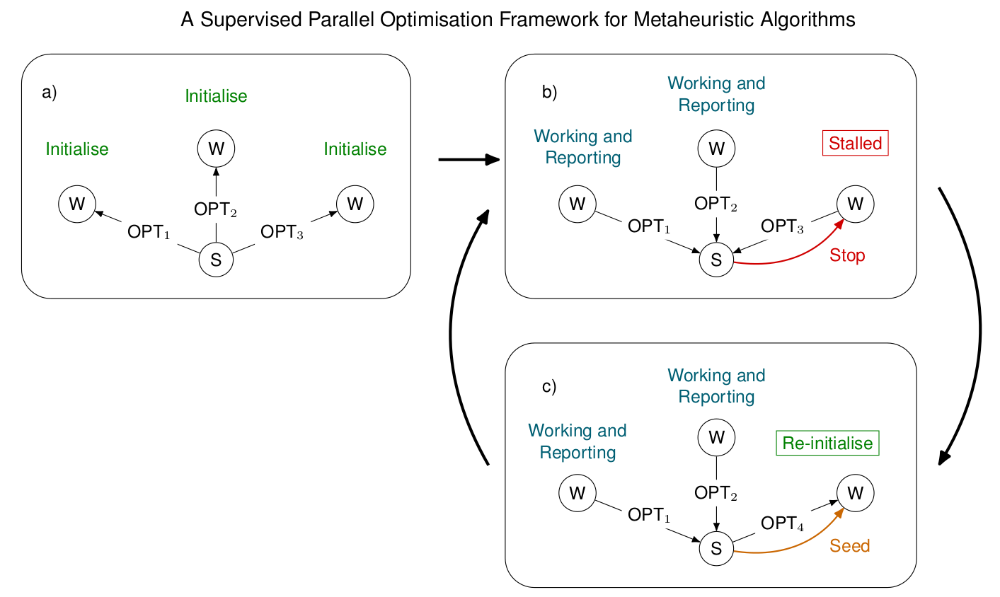
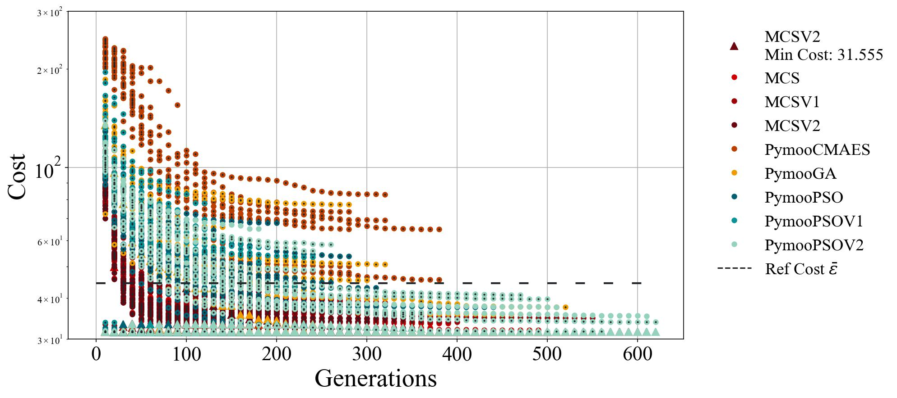
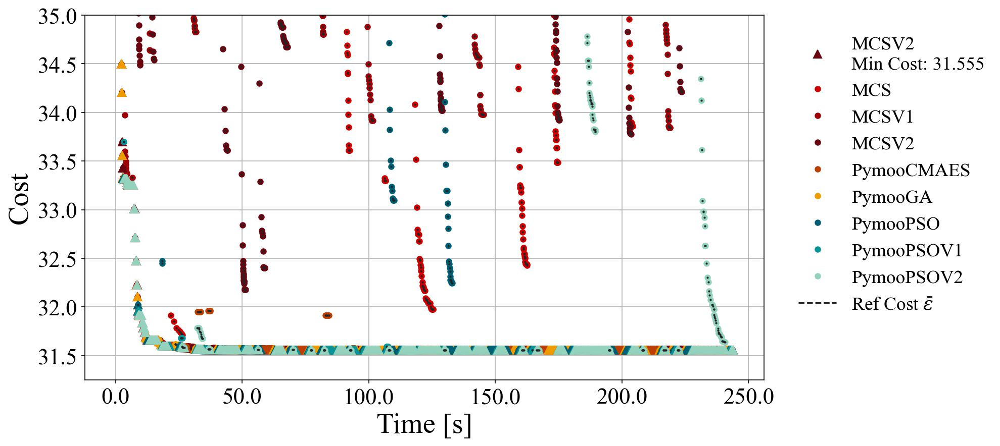
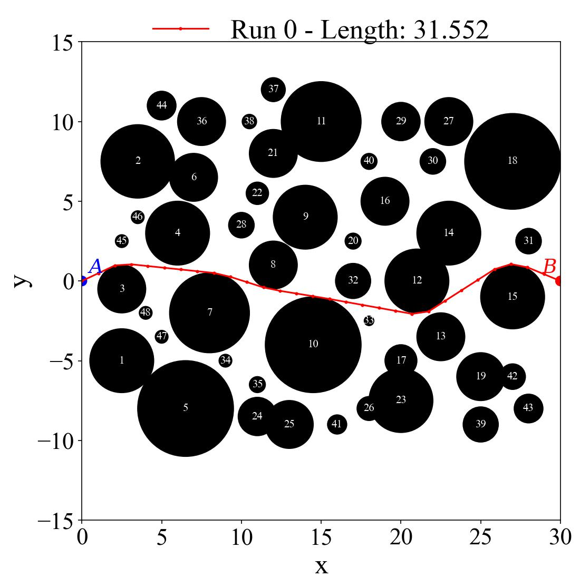

# Supervised Parallel Optimisation Framework

[](https://www.apache.org/licenses/LICENSE-2.0)
[](https://gitlab.com/EugenioMuttio/SPO)
[](https://gitlab.com/EugenioMuttio/SPO)


This repository contains code to utilize a parallel optimization
framework developed in:

Muttio, E. J., Dettmer, W. G., Clarke, J., Peric, D., Ren, Z. and
Fletcher, L. A Supervised Parallel Optimization Framework for
Metaheuristic Algorithms 2023, [Unpublished].

A novel Supervised Parallel Optimisation (SPO) balances exploration and exploitation of distinct optimisers to solve
problems with diverse characteristics. The strategy ensembles diverse gradient-free optimisation algorithms in
a wrapper-like framework.

The supervised strategy outperforms isolated algorithms, finding reproducible, optimal solutions to a complex path
finding problem with numerous local minima, and can be applied to a wide range of problems.

<p align="center">
 
</p>
<p align="center">
<em> Supervised parallel structure and roles of the processors in the proposed strategy. </em>
</p>

--------------
Code structure
--------------

The code is found in src. The lib directory contains opt and other
subdirectories, which contains the optimisers codes and general tools
respectively. The proj directory is where a subdirectory should be
created depending on the project to solve. Please refer to the project
example ‘path_find’, which solves a path finding problem function. It is
suggested that each project contains an individual project library or
‘plib’ with the function evaluation, reporting code and any auxiliar
routine that is not required by other projects. Use as template this
project to generate additional objective functions.

The project named ‘path_find’ is the objective function presented in the
cited paper.

--------------------
Installation (Conda)
--------------------

It is suggested to utilize an Anaconda environment to run the code. The environment can be created by running:

```bash
conda env create -f environment.yml
```

Activate the environment by running:

```bash
conda activate spo_env
```

If an installation problem occurs, verify environment_red.yml with the required conda and environment.yml pip packages to install manually.

-----
Usage
-----

A results/{proj_id} directory should be available, where {proj_id} is
the proj ID or name for the project solution.

To run the code, the active directory should be src/proj/{proj_name}
where {proj_name} is the name of the project to solve.

The proj directory requires a single main.py that assigns the objective
function and optimizers included in the supervised approach. As it is an
MPI-based code, the following call is required to run the program:

```bash
mpirun -n N python main.py –n_devices N
```

where the command ‘mpirun’ can be different depending on the MPI
installation (mpiexec, srun). N devices correspond to the total of
workers + 1 (supervisor).

Results visualisation can be obtained by using the reporting command
–report 1 (0 correspond to optimise). Then, a single CPU can be used:

```bash
    python main.py –report 1
```

It is also suggested to use the bash file run.sh to run the program. The
bash file can be modified to include the MPI call and the number of
devices and more parameters. The file run_paper.sh contains the same
parameters utilised to solve the path finding problem in the cited
paper.

Optimise:

```bash
    ./run.sh 0
```


Report:

```bash
    ./run.sh 1
```

It is suggested to read the argparse options available for general usage
(/lib/other/args_file) and project library (/proj/path_find/plib).

-------
Example
-------

A path finding problem with 30 variables is solved in the following
example. The objective function is defined in the
proj/path_find/plib/so_path.py file.

To run the code utilising 4 workers in parallel (MPI), the run.sh file
can be used as follows when the active directory is src/proj/path_find:

```bash
    ./run.sh 0
```
The results are stored in results/path_find. The results can be
visualised by running:

```bash
    ./run.sh 1
```

A similar convergence plot to the following should be obtained:
<p align="center">
 
</p>
<p align="center">
<em> Convergence plot for the path finding problem example (30 variables). </em>
</p>

<p align="center">
 
</p>
<p align="center">
<em> Convergence plot over time for the path finding problem example (30 variables). </em>
</p>

<p align="center">
 
</p>
<p align="center">
<em> Solution of the path finding problem example (30 variables). </em>
</p>

--------
Citation
--------
If you use this code in your own work or research presented in a publication, we ask that you please cite:

```
Muttio, E. J., Dettmer, W. G., Clarke, J., Peric, D., 
Ren, Z., and Fletcher, L. 
A Supervised Parallel Optimisation Framework for Metaheuristic Algorithms 2023, [Unpublished].
```

Bibtex:

```bibtex

    @article{muttio_spo,
    title = {A Supervised Parallel Optimisation Framework for
             Metaheuristic Algorithms},
    author = {Muttio, Eugenio J. and Dettmer, Wulf G. and
              Clarke, Jac and Peri\'c, Djordje and
              Ren, Zhaoxin and Fletcher, Lloyd},
    year = {2023}, }
```

----------
References
----------

The stand-alone algorithms utilised are
imported from [Pymoo: Multi-objective Optimization in Python](https://pymoo.org/):

[J. Blank and K. Deb, pymoo: Multi-Objective Optimization in Python, in
IEEE Access, vol. 8, pp. 89497-89509, 2020, doi:
10.1109/ACCESS.2020.2990567](https://ieeexplore.ieee.org/document/9078759)


An additional “Modified Cuckoo Search (MCS)” algorithm has been
translated into Python from the following reference:

[Walton, S., Hassan, O., Morgan, K., Brown, M.. Modified cuckoo search: a
new gradient free optimisation algorithm. Chaos, Solitions and Fractals
2011;44:710–718. doi:10.1016/j.chaos.2011.06.004.](https://www.sciencedirect.com/science/article/abs/pii/S096007791100107X)

-------
Support
-------

* Contact [Eugenio Muttio](mailto:e.j.muttiozavala@swansea.ac.uk)
